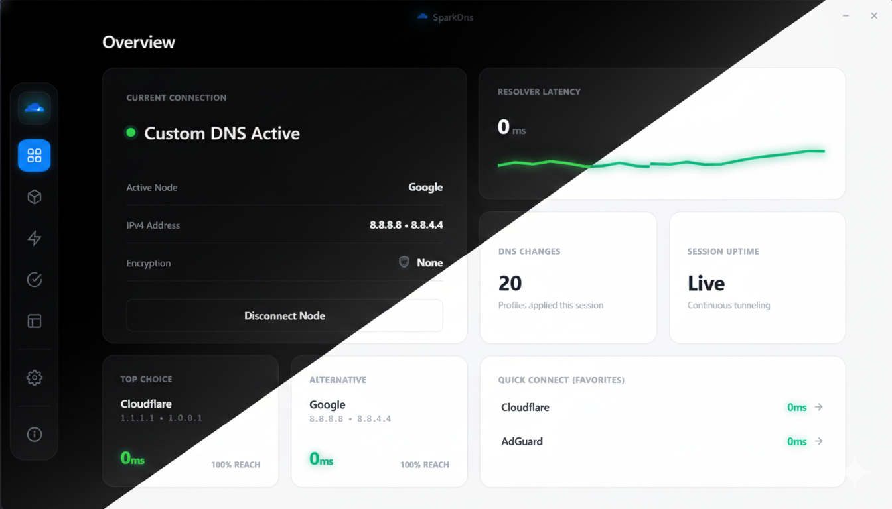

<div align="center">

# SparkDns

Cross-platform DNS management and optimization desktop app for Windows, Linux, and macOS.

[](https://rust-lang.org)
[](https://tauri.app)
[](https://github.com/Code-Leafy/SparkDns/blob/main/LICENSE)
[]()

</div>

---

<div align="center">



</div>

<br>

## Overview

SparkDns is a lightweight, native desktop application for managing and optimizing DNS settings across Windows, Linux, and macOS. Built with Tauri 2 (Rust backend + TypeScript frontend), it provides real-time DNS switching, diagnostics, and system tools without the memory overhead of Electron.

> **Privacy First:** All DNS operations run locally on your machine. No data is sent to external servers.

---

### Core Features

#### One-Click DNS Switching
Switch between pre-configured DNS providers or create custom profiles with IPv4/IPv6 support.

#### Real-Time Diagnostics
Run comprehensive DNS diagnostics with latency testing, DNSSEC validation, leak detection, and reachability probes against configurable targets.

#### System Tools
Flush DNS cache, renew DHCP, reset network adapters, and run traceroute — all from one panel.

#### Auto-Switch
Automatically switch DNS profiles based on network conditions or triggers.

#### Import/Export
Backup and restore your DNS configuration with JSON export/import.

#### Dark and Light Theme
System-aware theme with manual toggle support.

---

## Built-in DNS Providers

### Global Providers

| Provider | Primary IP | Secondary IP | Best For |
|----------|-----------|-------------|----------|
| Cloudflare | 1.1.1.1 | 1.0.0.1 | Maximum speed, privacy, and zero logging |
| Google DNS | 8.8.8.8 | 8.8.4.4 | Global routing stability and web reliability |
| Quad9 | 9.9.9.9 | 149.112.112.112 | Automatic threat intelligence and malware blocking |
| AdGuard DNS | 94.140.14.14 | 94.140.15.15 | System-wide ad, tracker, and popup blocking |
| OpenDNS | 208.67.222.222 | 208.67.220.220 | Family filtering and customizable security |
| Mullvad | 194.242.2.2 | 2a07:a4c0::2 | Privacy-focused, no-logs DNS |

### Regional Providers

| Provider | Primary IP | Secondary IP | Best For |
|----------|-----------|-------------|----------|
| Shecan | 178.22.122.100 | 185.51.200.2 | Developers accessing blocked libraries, tools, and tech sites |
| Electro | 78.157.42.100 | 78.157.42.101 | Gamers bypassing geo-restrictions to access online servers |
| 403.online | 10.202.10.10 | 10.202.10.11 | Developers and content creators needing restricted web APIs |
| Radar Game | 10.202.10.10 | 10.202.11.11 | Network stabilization and ping reduction for online gaming |

---

## Getting Started

### Prerequisites

- [Node.js](https://nodejs.org) (v18+)
- [Rust](https://rustup.rs) (1.70+)
- [Tauri CLI](https://tauri.app) (`cargo install tauri-cli`)

### Development

```bash
# Clone the repository
git clone https://github.com/Code-Leafy/SparkDns.git
cd SparkDns

# Install dependencies
npm install

# Start development server
npm run tauri:dev
```

### Build

```bash
# Build for production
npm run tauri:build
```

The installer will be located in `src-tauri/target/release/bundle/`.

---

## Project Structure

```text
SparkDns/
├── src/                          # TypeScript frontend
│   ├── main.ts                   # App bootstrap and view routing
│   ├── api.ts                    # Tauri command wrappers
│   ├── state.ts                  # Config state management
│   ├── types.ts                  # TypeScript interfaces
│   ├── defaults.ts               # DNS presets and default config
│   ├── styles.css                # App styles
│   ├── update.ts                 # Auto-update logic
│   ├── ui/                       # UI components (toast, dialog, etc.)
│   ├── views/                    # View modules (home, profiles, etc.)
│   └── utils/                    # Validation and helpers
├── src-tauri/                    # Rust backend
│   ├── Cargo.toml                # Rust dependencies
│   ├── tauri.conf.json           # Tauri configuration
│   ├── src/
│   │   ├── main.rs               # Tauri command registration
│   │   ├── lib.rs                # Library exports
│   │   ├── models.rs             # Shared data models
│   │   ├── config.rs             # Config persistence
│   │   ├── platform.rs           # OS capability detection
│   │   ├── diagnostics.rs        # DNS diagnostics
│   │   ├── validation.rs         # Input validation
│   │   ├── errors.rs             # Error types
│   │   ├── elevation.rs          # Privilege elevation
│   │   ├── command_runner.rs      # Safe command execution
│   │   ├── process_watcher.rs    # Process monitoring
│   │   └── dns/                  # OS-specific DNS backends
│   │       ├── mod.rs
│   │       ├── windows.rs
│   │       ├── macos.rs
│   │       └── linux.rs
│   └── icons/                    # App icons
├── package.json
├── tsconfig.json
├── vite.config.ts
└── index.html                    # Vite entry point
```

---

## Supported Platforms

| Feature | Windows | Linux | macOS |
|---------|---------|-------|-------|
| DNS Switching | Yes | Yes | Yes |
| DNS Cache Flush | Yes | Yes | Yes |
| DHCP Renew | Yes | Yes (NetworkManager) | No |
| Adapter Reset | Yes | No | No |
| Traceroute | Yes | Yes | Yes |
| DNS-over-HTTPS | Yes | No | Yes |
| System Tray | Yes | Yes | Yes |
| Auto-Start | Yes | Yes | Yes |

---

<details>
<summary><kbd>FAQ</kbd></summary>

**Why does DNS switching require elevation?**
Modifying system DNS settings is a privileged operation on all operating systems. SparkDns will prompt for elevation when needed.

**Does SparkDns work on ARM devices?**
SparkDns supports x86_64 on all platforms. ARM support depends on Tauri and Rust target availability.

**Is my DNS traffic encrypted?**
SparkDns configures your system DNS servers. For encrypted DNS, enable DNS-over-HTTPS in settings (Windows and macOS only).

</details>

<br>

<div align="center">

> **Educational Purpose Only:** This project is provided for educational and research purposes. Users are solely responsible for compliance with all local laws.

[MIT License](https://github.com/Code-Leafy/SparkDns/blob/main/LICENSE) · Crafted by [Code-Leafy](https://github.com/Code-Leafy)

</div>
