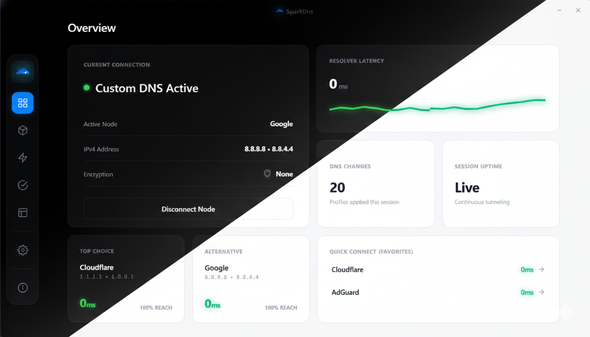

<div align="center">

# SparkDns

> Cross-platform DNS management and diagnostics, built with Tauri 2.

[](LICENSE)
[](https://github.com/Code-Leafy/SparkDns/stargazers)
[](https://github.com/Code-Leafy/SparkDns/releases/latest)
[](https://rust-lang.org)
[](https://tauri.app)
[](https://typescriptlang.org)

</div>

## Overview

SparkDns is a native desktop app for switching, testing, and managing DNS on Windows, Linux, and macOS. All operations run locally.

## Preview

<div align="center">

</div>

## Features

- One-click switching between built-in and custom DNS providers (IPv4/IPv6).
- Diagnostics: latency, DNSSEC, leak detection, and reachability probes.
- System tools: flush cache, renew DHCP, reset adapters, traceroute.
- Auto-switch profiles on network changes.
- JSON import/export and a system-aware dark/light theme.

## Built-in providers

| Provider | Primary | Secondary |
|----------|---------|-----------|
| Cloudflare | 1.1.1.1 | 1.0.0.1 |
| Google | 8.8.8.8 | 8.8.4.4 |
| Quad9 | 9.9.9.9 | 149.112.112.112 |
| AdGuard | 94.140.14.14 | 94.140.15.15 |
| OpenDNS | 208.67.222.222 | 208.67.220.220 |
| Mullvad | 194.242.2.2 | 2a07:a4c0::2 |
| Shecan | 178.22.122.100 | 185.51.200.2 |
| Electro | 78.157.42.100 | 78.157.42.101 |
| 403.online | 10.202.10.10 | 10.202.10.11 |
| Radar Game | 10.202.10.10 | 10.202.11.11 |

## Build from source

Prerequisites: [Node.js 18+](https://nodejs.org), [Rust 1.70+](https://rustup.rs), and the [Tauri CLI](https://tauri.app).

```bash
git clone https://github.com/Code-Leafy/SparkDns.git
cd SparkDns
npm install
npm run tauri:dev     # development
npm run tauri:build   # installer → src-tauri/target/release/bundle/
```

## License

[MIT](LICENSE)
